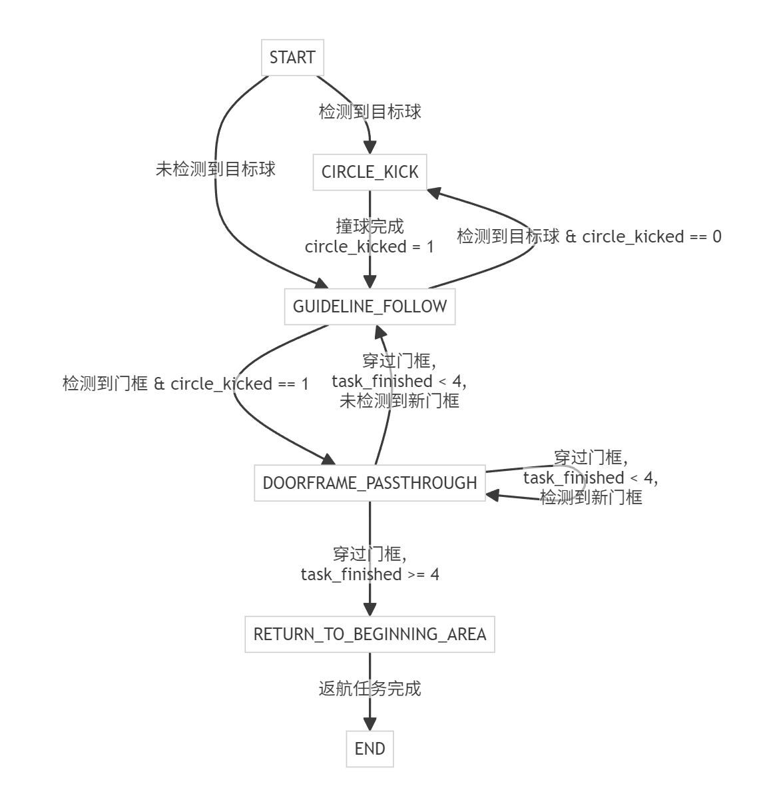
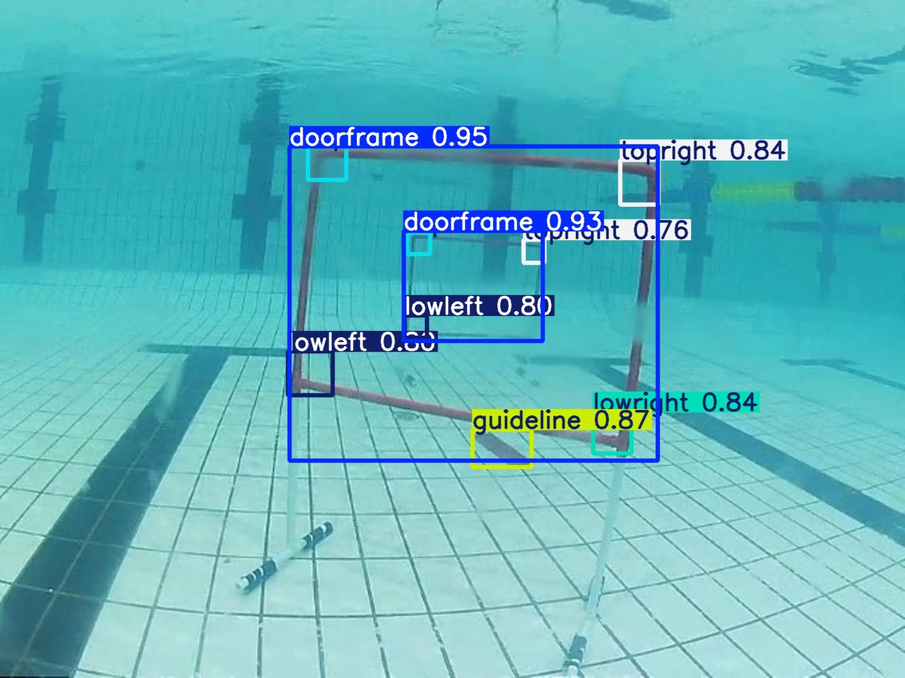
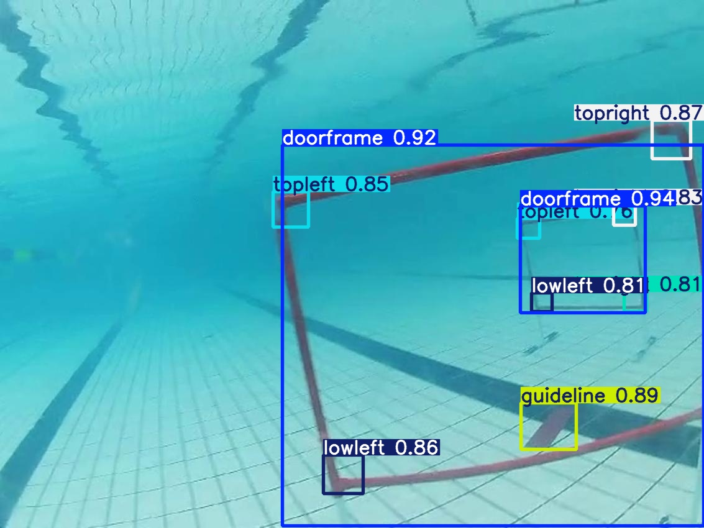

**English** | [简体中文](README.zh-CN.md)

# AUV Vision & Control

A visual perception and autonomous-control system for underwater robotics competitions. The project integrates YOLO object detection, guide-line recognition, PID control, serial communication, and a task state machine in one Python application to perform line following, ball striking, gate traversal, and return-to-start missions.



## Highlights

- Eight-class underwater object detection: a gate frame, four gate corners, red and blue balls, and guide lines.
- Layered state machine: line following, ball striking, gate traversal, action execution, return, and terminal states are decoupled.
- Multi-axis PID control: translation, depth, and yaw control with stability measures including integral anti-windup.
- Underwater image enhancement: CLAHE, gamma correction, brightness compensation, and combined modes.
- Jetson deployment interfaces: camera capture, serial I/O, performance monitoring, and video recording are modularized.
- Verifiable model assets: the repository includes the final PyTorch weights, sample media, and detailed evaluation evidence.

## System Structure

```text
.
├── main.py                         # Main robot loop and task state machine
├── src/modules/
│   ├── states/                     # Line following, ball striking, gate traversal, return, and other states
│   ├── vision/                     # YOLO, guide-line detection, and image enhancement
│   ├── control/                    # PID control and command fusion
│   ├── communicate/                # STM32 serial communication
│   ├── sensors/                    # Depth and yaw data processing
│   ├── visualization/              # On-screen debugging display
│   ├── videocapture/               # Dual-camera recording
│   └── metrics/                    # Runtime performance records
├── models/combine1014.pt           # Final eight-class detection model
├── configs/dataset.yaml            # YOLO dataset structure template
├── examples/                       # Two images and one demonstration video
├── tools/                          # Image/video inference and debugging tools
├── evaluation/                     # Single evaluation set and supporting evidence
└── docs/                           # Control design, flowcharts, and tuning notes
```

## Quick Start

Python 3.10 or 3.11 is recommended. Create an isolated environment and install the dependencies:

```bash
python -m venv .venv
source .venv/bin/activate
pip install -r requirements.txt
```

Run detection on the two sample images included in the repository:

```bash
python tools/detect_images.py
```

Results are written to `outputs/detected_images/` by default. You can also specify your own images, model, or device:

```bash
python tools/detect_images.py \
  --source path/to/images \
  --model models/combine1014.pt \
  --device cpu
```

Process the demonstration video:

```bash
python tools/batch_detect_test1015.py
```

## Detection Examples

The following results were generated with the final repository weights at `imgsz=640` and `conf=0.25`:





## Running on the Robot

`main.py` accesses cameras and serial ports directly. Run it on a Jetson device only after checking the hardware connections and configuration:

```bash
python main.py
```

The default interfaces include a front camera, an optional downward-facing camera, and the `/dev/ttyTHS1` serial port. Before the first hardware run, verify the camera indices, target-ball color, PID parameters, area thresholds, serial protocol, and emergency-stop behavior. Do not start the main program unless the thrusters are safely elevated or appropriate on-site safeguards are in place.

## Training Data

The complete training dataset is not included in this repository. To reproduce training, place the data under `dataset/` with the following structure:

```text
dataset/
├── train/
│   ├── images/
│   └── labels/
└── val/
    ├── images/
    └── labels/
```

Then run:

```bash
python train.py
```

Class definitions are available in `configs/dataset.yaml`.

## Available Evaluation Results

| Metric | Result | Evaluation basis |
| --- | ---: | --- |
| Precision | 0.99098 | Training-time validation set |
| Recall | 0.99343 | Training-time validation set |
| mAP@50 | 0.99497 | Training-time validation set |
| mAP@50:95 | 0.88885 | Training-time validation set |
| Mean CPU inference time | 2488.820 ms/image | Two unlabeled images, each timed over 10 runs |

The accuracy metrics come from validation records produced during training and are not results from an independent test set. The available materials do not include a separate labeled test set that can be shown to have remained unused during training and tuning. The project therefore does not report an independent-test mAP or treat the number of predicted boxes in sample images as ground-truth object counts. See [`evaluation/README.md`](evaluation/README.md) for the full conditions, evidence, and limitations.

## Documentation

- [`docs/PROJECT_REQUIREMENTS.md`](docs/PROJECT_REQUIREMENTS.md): mission goals, state flow, and interface requirements.
- [`docs/new_control_logic_design.md`](docs/new_control_logic_design.md): control-logic design.
- [`docs/pid_paras.md`](docs/pid_paras.md): PID parameter notes.
- [`docs/IMAGE_ENHANCEMENT_GUIDE.md`](docs/IMAGE_ENHANCEMENT_GUIDE.md): underwater image-enhancement guide.
- [`evaluation/README.md`](evaluation/README.md): evaluation definitions, limitations, and reproducibility information.
