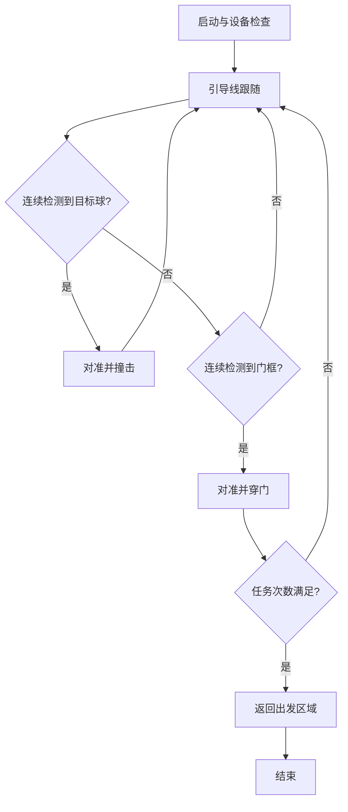

# AUV 视觉控制项目需求

## 项目目标

系统面向水下机器人竞赛，负责视觉识别、任务决策和运动控制，不包含艇体、推进器、电控底层或传感器硬件设计。机器人应按顺序完成：

1. 识别并跟随水下引导线；
2. 识别指定颜色目标球，完成对准和撞击；
3. 识别门框及角点，完成姿态调整和穿越；
4. 重复任务流程，并在满足次数要求后返回出发区域。

## 感知范围

YOLO 模型包含 8 个类别：

- `doorframe`
- `topleft`
- `topright`
- `lowright`
- `lowleft`
- `red_circle`
- `blue_circle`
- `guideline`

前置摄像头用于目标检测和前视循线；下置摄像头用于近距离引导线位置与角度对准。下置摄像头不可用时，系统应进入预定降级逻辑。

## 状态流程



### 引导线跟随

- 前视摄像头持续检测引导线和更高优先级任务目标。
- 检测到引导线时，PID 持续修正横向位置和前进速度。
- 前视目标丢失且此前已看到引导线时，切换下视摄像头进行 X、Y、Yaw 三轴对准。
- 对准完成后短时前进，再返回前视循线；搜索超时则回到前视模式。

### 目标球撞击

- 根据配置选择红球或蓝球作为目标。
- 使用视觉误差控制横向/偏航和深度，并用目标框面积估计接近程度。
- 对准稳定且距离满足阈值后执行固定时长的非阻塞前进动作。
- 临时丢失目标时使用受限的上一有效指令，避免控制量突变。

### 门框穿越

- 以面积最大的门框作为主目标，并关联四个角点。
- 门框中心用于 X/Y 对准，左右立柱的几何差异用于 Yaw 修正。
- 满足距离、位置和姿态条件后执行固定时长的穿门动作。
- 支持只检查中心与面积的低标准调试模式，上场前应确认该开关符合比赛策略。

## 控制与通信

运动控制覆盖四个通道：

- 前后平移；
- 左右平移；
- 上下/深度控制；
- 偏航控制。

Nano 向 STM32 发送：

```text
[AB][speed_FB][speed_LR][speed_UD][speed_Yaw][CD]
```

STM32 向 Nano 返回：

```text
[AA][yaw_H][yaw_L][depth][BB]
```

速度字节范围为 0–255，128 为中性值。串口读取由独立线程完成，并保留最新有效的偏航和深度样本。

## 安全与验收

上机前至少应完成：

- 推进器架空状态下的串口方向和中性值检查；
- 摄像头编号、帧率、分辨率和掉线降级检查；
- 目标球颜色、检测阈值、面积阈值和 PID 参数检查；
- 紧急停止、状态超时和传感器陈旧数据处理检查；
- 独立记录每次循线、撞球、穿门和返航任务的成功、超时与人工干预。

检测模型在训练期验证集上的指标不能代替真实水下任务成功率。正式验收应事先定义成功条件、超时规则和人工干预标准，并保留完整视频和逐次记录。
