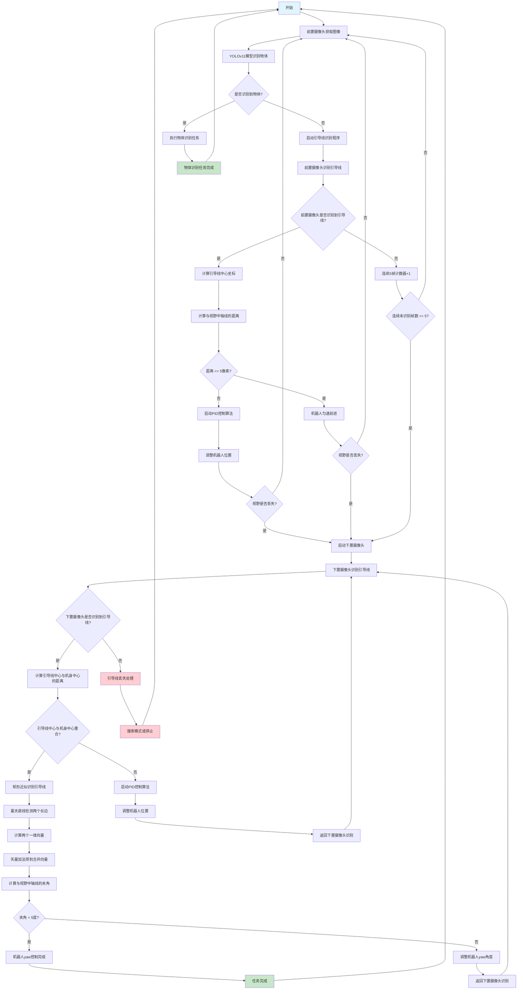

# 引导线识别与控制流程图

## 详细说明

### 主要分支逻辑：

1. **物体识别优先**：如果YOLOv11识别到物体，优先执行物体识别任务
2. **前置摄像头引导线识别**：
   - 识别成功：PID控制使引导线居中，然后匀速前进
   - 识别失败：连续5帧未识别后切换到下置摄像头
3. **下置摄像头引导线识别**：
   - 位置控制：PID控制使引导线中心与机身中心重合
   - 角度控制：霍夫直线检测 + 矢量计算 + yaw控制

### 关键参数：
- **距离阈值**：5像素（视野中轴线对齐）
- **角度阈值**：5度（yaw控制精度）
- **连续帧数**：5帧（前置摄像头切换条件）

### 控制算法：
- **PID控制**：位置和角度控制
- **霍夫变换**：直线检测
- **矢量运算**：角度计算和合成 