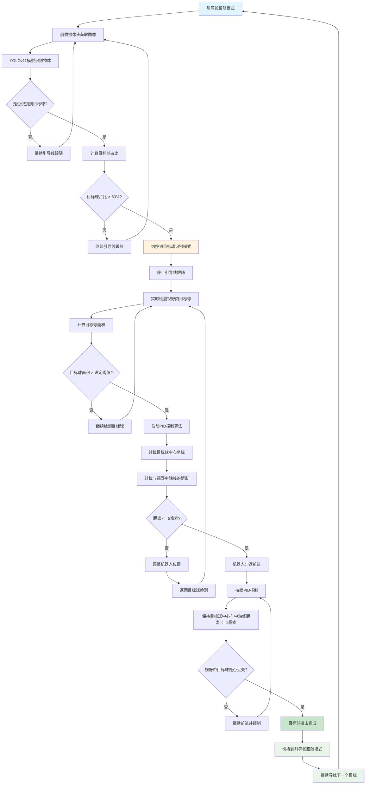

# 目标球识别与撞击流程图

## 流程描述
该流程图描述了AUV机器人在引导线跟随过程中发现目标球后，如何切换到目标球识别与撞击模式的完整流程。

## 关键节点说明

### 1. 模式切换条件
- **目标球检测**: 使用YOLOv11模型识别视野中的目标球
- **占比判断**: 目标球在目标检测寄存器列表中的占比必须大于50%
- **面积阈值**: 目标球面积必须大于预设阈值才能启动撞击流程

### 2. 控制策略
- **PID控制**: 确保目标球中心与视野中轴线距离保持在5像素以内
- **匀速前进**: 当目标球位置正确时，机器人以恒定速度前进
- **持续控制**: 在前进过程中持续调整位置，保持目标球在视野中心

### 3. 状态转换
- **引导线跟随 → 目标球识别**: 当检测到目标球且占比超过50%时
- **目标球识别 → 引导线跟随**: 当目标球从视野中丢失时，表示撞击完成

### 4. 异常处理
- 如果目标球面积未达到阈值，继续检测
- 如果目标球位置偏离中轴线超过5像素，持续调整
- 如果目标球丢失，认为撞击完成，返回引导线跟随模式 